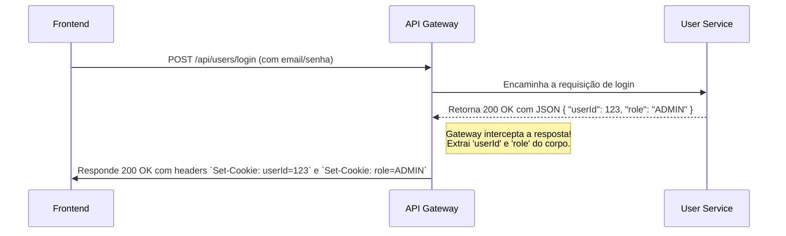
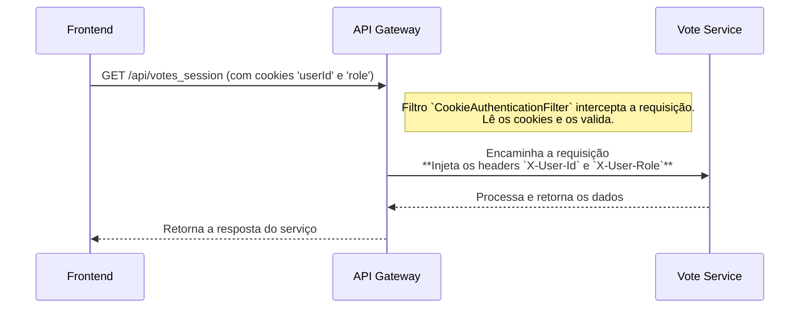

# 🚀 API Gateway - Sistema de Votação

O API Gateway é o **ponto de entrada único (Single Point of Entry)** para todo o ecossistema do Sistema de Votação. Construído com **Spring Cloud Gateway**, ele é responsável por rotear as requisições do cliente para os microsserviços apropriados, além de gerenciar a autenticação e a sessão do usuário de forma centralizada.

Ele atua como uma fachada, protegendo os serviços internos e simplificando a comunicação para o frontend.

## 🏗️ Fluxo de Autenticação e Roteamento

O Gateway implementa um modelo de **autenticação baseada em cookies**, que serve como a principal camada de segurança para os serviços internos.

### 1\. Fluxo de Login

O processo de login é orquestrado pelo Gateway, que transforma a resposta do `user-service` em uma sessão de navegador via cookies.



### 2\. Fluxo de Requisição Autenticada

Uma vez que o usuário está logado, o navegador envia os cookies em todas as requisições subsequentes. O Gateway os utiliza para autorizar e enriquecer as chamadas para os microsserviços.



-----

## ✅ Principais Responsabilidades

1.  **Roteamento Centralizado**: Direciona o tráfego para os microsserviços corretos com base no path da URL. As rotas são configuradas estaticamente para os endereços dos serviços na plataforma **Render**.
2.  **Gerenciamento de Sessão com Cookies**:
      - Após um login bem-sucedido no `user-service`, o Gateway **cria e define cookies HTTP (`userId`, `role`)** no navegador do cliente.
      - No logout, o Gateway é responsável por **expirar e remover** esses cookies.
3.  **Injeção de Headers de Segurança (Pré-Autenticação)**:
      - Para todas as rotas protegidas, o filtro `CookieAuthenticationFilter` verifica a presença dos cookies de autenticação.
      - Se válidos, ele **traduz os valores dos cookies para headers HTTP (`X-User-Id`, `X-User-Role`)** e os injeta na requisição antes de encaminhá-la ao serviço de destino. Isso desacopla os microsserviços do método de autenticação.
      - Se os cookies estiverem ausentes, a requisição é **bloqueada com status `403 Forbidden`** antes mesmo de alcançar os serviços internos.
4.  **Configuração de CORS**: Gerencia a política de Cross-Origin Resource Sharing para todo o sistema, permitindo que o frontend (hospedado em um domínio diferente) se comunique com a API.

-----

## ⚙️ Tecnologias Utilizadas

| Categoria | Tecnologias |
| :--- | :--- |
| **Framework** | Spring Cloud Gateway, Spring Boot 3, Project Reactor (WebFlux) |
| **Segurança** | Spring Security for WebFlux, Autenticação customizada via Cookies |
| **Infra & Deploy**| Docker, **Render** |

-----

## 🗺️ Mapeamento de Rotas

| Path da Requisição | Microsserviço de Destino | Autenticação Exigida? |
| :--- | :--- | :--- |
| `/api/users/register` | `user-service` | ❌ Não |
| `/api/users/login` | `user-service` | ❌ Não (Gateway cria cookies na resposta) |
| `/api/users/logout` | `user-service` | ⚠️ Sim (Gateway expira cookies na requisição)|
| `/api/users/**` | `user-service` | ✅ Sim (Filtro de Cookies) |
| `/api/votes/**` | `vote-service` | ✅ Sim (Filtro de Cookies) |
| `/api/votes_session/**`| `vote-service` | ✅ Sim (Filtro de Cookies) |

**Observação sobre o Service Discovery:**
Nesta configuração de produção para a **Render**, o Gateway utiliza URLs fixas para os serviços e **não** se conecta ao Eureka (`eureka.client.enabled: false`).

-----

## 🛠️ Configuração e Variáveis de Ambiente

| Variável | Descrição | Exemplo |
| :--- | :--- | :--- |
| `PORT` | Porta em que o Gateway irá rodar. | `8080` |
| `ALLOWED_ORIGINS_LIST`| Lista de URLs do frontend (separadas por vírgula) permitidas pelo CORS. | `https://meu-frontend.com,http://localhost:3000` |

-----

## 🐳 Como Executar (Docker)

**1. Construindo a Imagem Docker:**
Na raiz do projeto, execute o comando:

```bash
docker build -t voting-system/api-gateway .
```

**2. Rodando o Container:**

```bash
docker run -p 8080:8080 \
  -e ALLOWED_ORIGINS_LIST="http://localhost:3000" \
  --name api-gateway \
  voting-system/api-gateway
```

O Gateway estará disponível em `http://localhost:8080`.